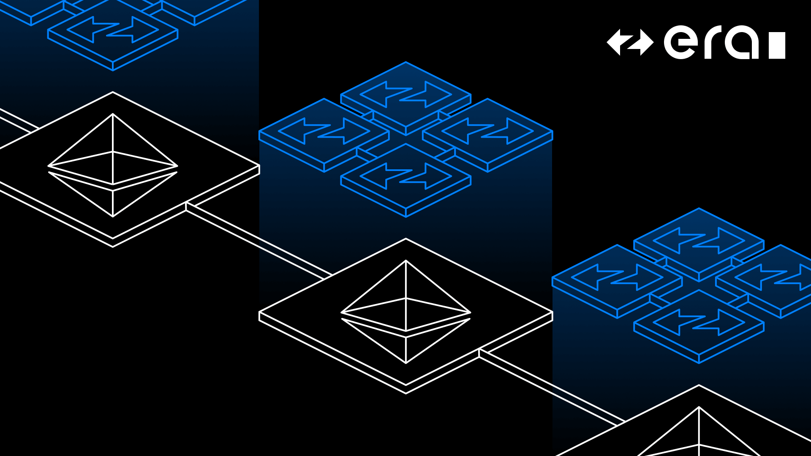

# zkSync Era: A ZK Rollup For Scaling Ethereum

zkSync Era is a layer 2 rollup that uses zero-knowledge proofs to scale Ethereum without compromising on security or
decentralization. Since it's EVM compatible (Solidity/Vyper), 99% of Ethereum projects can redeploy without refactoring
or re-auditing a single line of code. zkSync Era also uses an LLVM-based compiler that will eventually let developers
write smart contracts in C++, Rust and other popular languages.

## Boojum-cuda
Boojum-cuda is a library implementing GPU-accelerated cryptographic functionality for the zkSync prover.

Requirements: CUDA 12.x CMake 3.24 and up clang rust nightly toolchain

By default, the CUDA code is built for the GPU that is present on the system. If there is no GPU in the system or 
another architecture is desired, the environment variable `CUDAARCHS` can be set to the desired architecture. 
See https://cmake.org/cmake/help/latest/variable/CMAKE_CUDA_ARCHITECTURES.html.

## Policies

- [Security policy](.github/SECURITY.md)
- [Contribution policy](CONTRIBUTING.md)

## License

zkSync Era is distributed under the terms of either

- Apache License, Version 2.0, ([LICENSE-APACHE](LICENSE-APACHE) or <http://www.apache.org/licenses/LICENSE-2.0>)
- MIT license ([LICENSE-MIT](LICENSE-MIT) or <http://opensource.org/licenses/MIT>)

at your option.

## Official Links

- [Website](https://zksync.io/)
- [GitHub](https://github.com/matter-labs)
- [ZK Credo](https://github.com/zksync/credo)
- [Twitter](https://twitter.com/zksync)
- [Twitter for Devs](https://twitter.com/zkSyncDevs)
- [Discord](https://join.zksync.dev)

## Disclaimer

zkSync Era has been through lots of testing and audits. Although it is live, it is still in alpha state and will go
through more audits and bug bounties programs. We would love to hear our community's thoughts and suggestions about it!
It is important to state that forking it now can potentially lead to missing important security updates, critical
features, and performance improvements.
